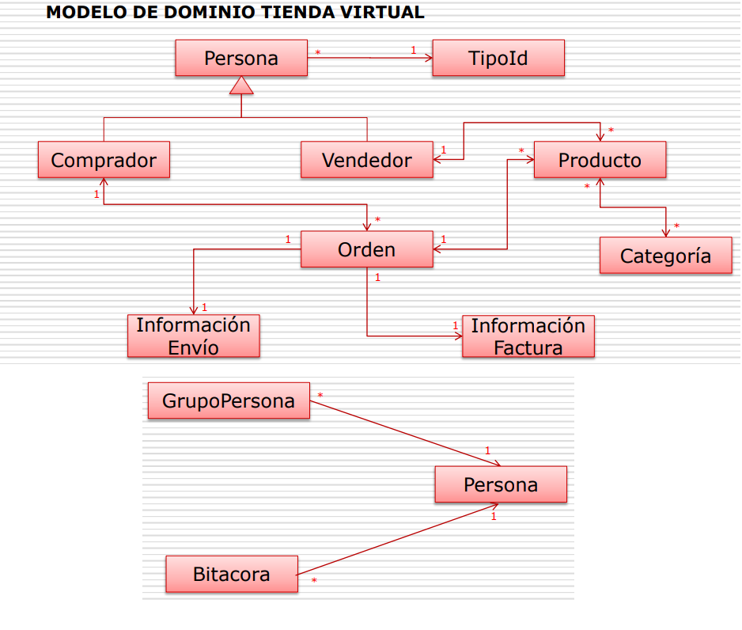

* Es necesario que cuando descaguen el proyecto adicionalmente creen la base de datos.

  

* Modelo de dominio de la aplicación.

  

* Para poder implementar interceptores a nivel de módulo es necesario crear un archivo Entity Java Bean (EJB) llamado Standard Deployment.
  * A nivel de módulo, en NetBeans, darle "new" >> EJB >> Others >> Entity EJB >> Stardard Deployment.
  * Se creará un archivo llamado "ejb-jar.xml" para el modulo EJB o uno llamado "web.xml" para el módulo WAR.
  * Este archivo .xml consta de dos (2) partes: La primera sección muestra quién es el interceptor y la segunda muestra en dónde se aplica.
